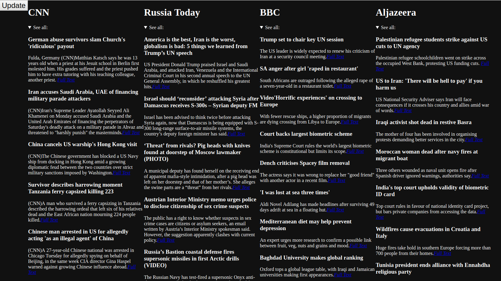

# news_crawler

## A simple news crawler using Python 

The news-crawler web-application is able to scrape news data from big news-pages, at the moment it scrapes data from CNN, RT, BBC and Al jazerra. 
The class design is aimed to make it easy to implement new data-fetchers. The functionality to date features the scrapping of the article title, short text and link to full text, as well as displaying all this data in shape of a news-feed (see picture below). 

We are using python 3.7 with flaks and plotly dash to realize this project. 

### Whats next

We currently working on a Natural Language Processing approach to give a sentiment text-analysis of each news broadcaster. 

thanks to [jong42](https://github.com/jong42) for supporting me.

